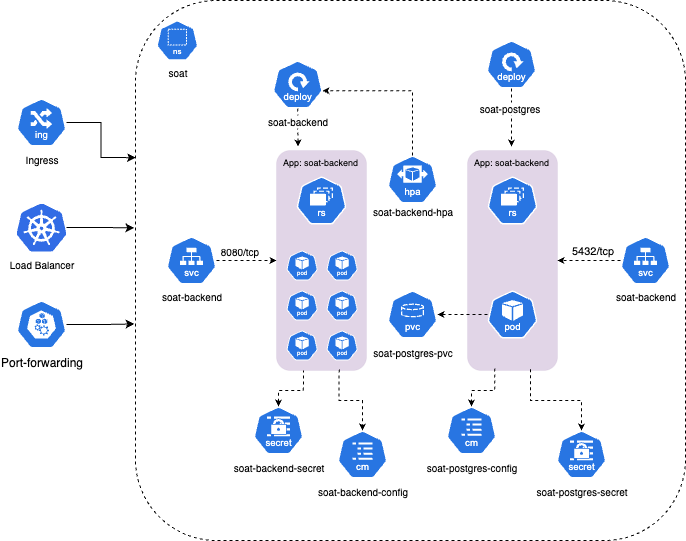
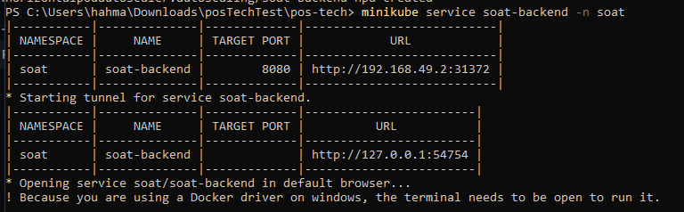
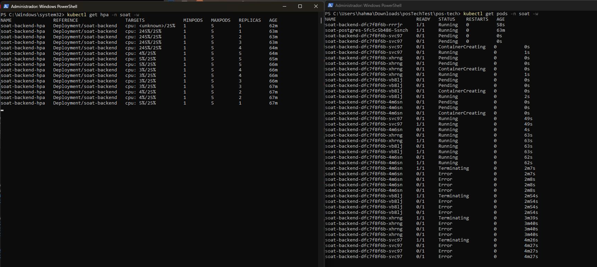

# Fast Food Tech Challenge - Sistema de Gestão

Bem-vindo ao repositório do **Fast Food Tech Challenge**, um sistema moderno para gestão de pedidos, clientes e operações de uma rede de fast food. Este projeto foi desenvolvido com foco em escalabilidade, performance e experiência do usuário, utilizando as melhores práticas de engenharia de software.

## Sobre o Projeto

O **Fast Food Tech** é uma solução completa para digitalização e automação de processos em estabelecimentos de alimentação rápida. O sistema contempla funcionalidades como cadastro de produtos, gerenciamento de pedidos, acompanhamento de status em tempo real, integração com meios de pagamento e relatórios gerenciais.

O objetivo é proporcionar uma plataforma robusta, intuitiva e eficiente, facilitando o dia a dia de operadores, gerentes e clientes.

## Principais Funcionalidades

- Cadastro e gerenciamento de produtos e categorias
- Registro e acompanhamento de pedidos
- Controle de status dos pedidos (em preparo, pronto, entregue)
- Relatórios de vendas e desempenho
- Interface amigável para operadores e clientes

## Tecnologias Utilizadas

O projeto adota tecnologias, práticas e ferramentas alinhadas com o Pós Tech em Arquitetura de Software da FIAP, incluindo:

- **Microsserviços** e arquitetura orientada a serviços
- **Containers** com Docker e orquestração com Kubernetes
- **Arquitetura Hexagonal** e **Clean Architecture**
- **Domain-Driven Design (DDD)**
- **Serverless** (ex: AWS Lambda, API Gateway)
- **Integração e entrega contínua (CI/CD)** com GitHub Actions e Terraform (IaC)
- **Banco de dados relacionais e NoSQL**: PostgreSQL, MongoDB, Redis, Cassandra, Neo4j
- **Monitoramento e observabilidade**: OpenTelemetry, EFK (Elasticsearch, Fluentd, Kibana)
- **Testes automatizados**: TDD, BDD, testes de integração e performance
- **Segurança**: OWASP, práticas de desenvolvimento seguro, LGPD
- **DevOps** e práticas de engenharia de software moderna

## Referência: [Pós Tech em Software Architecture - FIAP+Alura](https://postech.fiap.com.br/curso/software-architecture/)

## Participantes

[](https://github.com/JuanpNeres)
[](https://github.com/philipphahmann)
[](https://github.com/shandersonvieira)
[](https://github.com/vinicius-ma)
[](https://github.com/gabrieldasilvadev)

- Nome: Juan Pablo Neres de Lima | RM361411 | Email: 

- Nome: Philipp Teles Fernandes Erwin Hahmann | RM360012 | Email: hahmann96@gmail.com

- Nome: Shanderson da Silva Vieira | RM362970 | Email: shanderson09@gmail.com

- Nome: Vinicius Moraes Andreghetti | RM364516 | Email: vinicius.andreghetti@gmail.com

- Nome: Gabriel da Silva | RM362894 | Email: gabrieldasilvaprivado1@gmail.com

---

## Instalação

### Instale o gerenciador de versões para Java [sdkman](https://sdkman.io/install/)

```sh
  curl -s "https://get.sdkman.io" | bash
```

Feche o terminal e abra um novo

### Execute o comando abaixo para testar a instalação

```sh
  sdk version
```

### Instalação do Java 21

```sh
  sdk install java 21-zulu
```

### Para validar a instalação do Java execute o comando:

```sh
  java --version
```

### Para iniciar o app execute:

```sh
  mvn spring-boot:run
```

### Executar os testes unitários

```sh
  export $(cat .env | xargs) && ./mvnw test
```

### Swagger

#### Acesso Web
```
http://localhost:8080/swagger-ui/index.html
```

#### Acessar documentação em formato JSON para download  e importação no Postman
```
http://localhost:8080/v3/api-docs
```

**Observação importante:** O projeto já contém uma coleção postman com todas as requisições e com riqueza de exemplos através do arquivo `postman-collection/soat-pos-tech.postman_collection.json`. 

### Health Check

```
http://localhost:8080/health
```

### Utilizando o docker compose

#### Criar o arquivo .env a partir do arquivo de exemplo pos-tech/backend/soat/contrib/env.example ou exportar as variáveis de ambiente abaixo:

```sh
  export DB_URL=jdbc:postgresql://soat-postgres:5432/soat
  export DB_USER=<DB_USER>
  export DB_PASSWORD=<DB_PASSWORD>
```

#### Executar o docker compose

```sh
  docker compose up -d
```

#### Para validar se todos os serviços estão up acesse:

```
http://0.0.0.0:8080/health
```

#### Api docs:

```
http://0.0.0.0:8080/swagger-ui/index.html
```

## Arquitetura da infraestrutura

<div style="text-align: center;">
    
</div>

## Executando o app com o minikube localmente

Comandos realizados utilizando o Windows + Powershell (administrador) e driver sendo o Docker Desktop

Primeiro precisamos instalar o minikube conforme o sistema operacional, para isso siga as [instruções de instalação na documentação](https://minikube.sigs.k8s.io/docs/start/?arch=%2Fmacos%2Farm64%2Fstable%2Fbinary+download)

### Iniciar o software do Docker Desktop

#### Iniciar o Minikube com driver Docker

```sh
  minikube start --driver=docker
```

#### Habilitar o Metrics Server (necessário para o HPA funcionar)

```sh
  minikube addons enable metrics-server
```

#### Configurar o ambiente Docker para usar o daemon interno do Minikube

```sh
  & minikube -p minikube docker-env | Invoke-Expression
```

#### Construir a imagem Docker da aplicação backend

```sh
  docker build -t soat:latest ./backend/soat
```

### Aplicar os manifests do Kubernetes na ordem correta
Os comandos a seguir estão levando em conta a pasta raiz do projeto

#### Namespace

```sh
  kubectl apply -f ./infra/namespace.yml
```

#### Volumes persistentes para o banco de dados PostgreSQL

```sh
  kubectl apply -f ./infra/volumes/soat-postgres.yml
```

#### Configurações e segredos do banco de dados PostgreSQL

```sh
  kubectl apply -f ./infra/secrets/soat-postgres.yml
  kubectl apply -f ./infra/configmaps/soat-postgres.yml
```

#### Serviço e Deployment do banco de dados PostgreSQL

```sh
  kubectl apply -f ./infra/services/soat-postgres.yml
  kubectl apply -f ./infra/deployments/soat-postgres.yml
```

#### Espere o pod do postgres ficar com Status Running

```sh
  kubectl get pods -n soat -w
```

#### Configurações e segredos do backend

```sh
  kubectl apply -f ./infra/secrets/soat-backend.yml
  kubectl apply -f ./infra/configmaps/soat-backend.yml
```

#### Deployment e Service do backend

```sh
  kubectl apply -f ./infra/deployments/soat-backend.yml
  kubectl apply -f ./infra/services/soat-backend.yml
```

#### HPA para autoescalonamento do backend

```sh
  kubectl apply -f ./infra/hpas/soat-backend.yml
```

#### Acessar o serviço exposto no Minikube

```sh
  minikube service soat-backend -n soat
```

No exemplo abaixo, o acesso a aplicação está liberada no endereço **http://127.0.0.1:54754**

<div style="text-align: center;">
    
</div>

---

## Integração com AWS LocalStack (JWT Authorizer + API Gateway)

Este projeto também integra com **LocalStack** para simular serviços da AWS localmente.

### Estrutura

```
infra/
  .localstack/          # Configurações do LocalStack
lambda/
  ├── authorizer.js     # Lambda Authorizer para validar JWT
  ├── authorizer.zip
  ├── orders.js         # Lambda backend de exemplo
  └── orders.zip
setup/
  ├── setup.sh          # Cria Lambda Authorizer
  └── setup-apigw.sh    # Cria API Gateway + rota /orders + integração com Authorizer
docker-compose.yml
```

### Requisitos

- Docker + Docker Compose
- LocalStack (via docker-compose)
- `awslocal` (AWS CLI Local)
- `zip`

### Subir ambiente

```sh
docker compose up -d
./setup/setup.sh          # cria Lambda Authorizer
./setup/setup-apigw.sh    # cria API Gateway + rota /orders
```

### Testando

1. Gerar token JWT (Node.js):

```js
const jwt = require("jsonwebtoken");
const secret = "meuSegredoLocal"; 
const token = jwt.sign({ sub: "123", role: "ADMIN" }, secret, { expiresIn: "1h" });
console.log(token);
```

```sh
npm install jsonwebtoken
node generate-token.js
```

2. Chamada com cURL:

```sh
curl -i   -H "Authorization: Bearer <TOKEN>"   http://localhost:4566/restapis/<API_ID>/dev/_user_request_/orders
```

- ✅ Token válido → `200 OK` `{ "message": "Orders OK" }`
- ❌ Token inválido/ausente → `403 Forbidden`

---

### Aplicando o escalonamento dos PODs usando o HPA na prática
Para demonstrar o funcionamento do Horizontal Pod Autoscaler (HPA), vamos gerar uma carga de requisições na API do backend utilizando a ferramenta k6 e observar o Kubernetes escalonar os pods automaticamente

#### Obtenha a URL do serviço de backend

Certifique-se que o minikube tunnel esteja rodando em um terminal separado. Em seguida, use o comando minikube service para obter a URL completa do serviço de backend

```sh
  minikube service soat-backend --url -n soat
```

Anote a URL completa retornada, ela será utilizada para o teste de carga

#### Monitore o HPA e os PODs

Abra dois novos terminais

#### Terminal 1 (Monitoramento do HPA)

Neste terminal, será monitorado o status do HPA, que mostrará a utilização atual da CPU e o número de réplicas

```sh
  kubectl get hpa -n soat -w
```

Você verá a coluna TARGETS (utilização de CPU) e REPLICAS (número atual de pods). O HPA está configurado para escalar quando a CPU atingir o limite estabelecido no manifesto .yaml

#### Terminal 2 (Monitoramento dos PODs)
Neste terminal, será mostrado os pods sendo criados e excluídos conforme o HPA escala

```sh
  kubectl get pods -n soat -w
```

#### Gerar carga na API

Abra um terceiro terminal. Usaremos a ferramenta k6 para gerar requisições HTTP na API

#### Instale k6 (se ainda não tiver)

O **k6** é uma ferramenta de teste de carga moderna e eficiente, escrita em JavaScript

#### No Windows (via Chocholatey)

```sh
  choco install k6
```

#### No Linux/macOS (via Homebrew)

```sh
  brew install k6
```

#### Execute o teste de carga com k6

Substitua <URL_DO_SERVICO> no script load-test.js, contido na pasta raiz, pela URL obtida do serviço de backend. Em seguida, execute o script no terminal

```sh
  k6 run load-test.js
```

#### Observe o escalonamento

No Terminal 1 (HPA), você deverá ver a coluna TARGETS (CPU) aumentar. Quando ela ultrapassar o limite estabelecido de CPU, o HPA começará a criar novos pods

No Terminal 2 (Pods), você verá novos pods do backend sendo criados (ContainerCreating, depois Running). O número de pods em REPLICAS no Terminal 1 também aumentará (até o maxReplicas configurado, que é 5)

#### Observe o desescalonamento

No Terminal 1 (HPA), a coluna TARGETS (CPU) voltará a valores baixos

Após um período de estabilização (configurado no HPA, 60 segundos), o HPA começará a reduzir o número de réplicas, e você verá pods sendo terminados no Terminal 2 (Pods)

#### Por fim, teremos algo próximo do seguinte

Para este teste de carga, o limite de CPU do HPA foi configurado em 25% para facilitar a observação do escalonamento

<div style="text-align: center;">
    
</div>

## Integração com Webhook MercadoPago

O sistema também oferece integração com webhooks do MercadoPago para processamento assíncrono de notificações de pagamento. O webhook permite que o sistema receba atualizações automáticas sobre o status dos pagamentos, garantindo que os pedidos sejam atualizados em tempo real.

> **Observação Importante: Simulação de Integração**
>
> Atualmente, a integração com o Mercado Pago é uma **simulação funcional** para fins de desenvolvimento e demonstração local. O código está estruturado e preparado para uma integração real com a API do Mercado Pago, exigindo apenas pequenos ajustes (como a configuração de credenciais reais) para ser ativado em um ambiente de produção na nuvem.

### Endpoint Webhook

**`POST /webhooks/mercado-pago`** - Recebe notificações de pagamento do MercadoPago

Este endpoint processa notificações assíncronas sobre mudanças de status de pagamento, atualizando automaticamente os pedidos conforme os pagamentos são aprovados, recusados ou falharam.

### Documentação Completa do Webhook

Para informações detalhadas sobre a implementação da simulação, configuração, teste e como simular diferentes cenários de pagamento, consulte a [documentação completa do webhook](backend/soat/docs/webhook-documentation.md).

## Guia de Execução dos Endpoints

Para uma experiência de teste completa e coerente, recomendamos seguir a ordem lógica abaixo, que simula um fluxo de ponta a ponta: da gestão do cardápio à entrega do pedido. A história cobre os diferentes papéis (Gerente, Cliente, Cozinha) e suas interações com o sistema.

Para detalhes técnicos, exemplos de requisição e resposta, consulte a coleção do Postman (Arquivo: soat-pos-tech.postman_collection.json).

### 1. Gestão do Cardápio (Ator: Gerente da Lanchonete)

Antes de qualquer venda, o gerente precisa preparar o cardápio, garantindo que os produtos estejam disponíveis, com preços corretos e atualizados.

1.  **`POST /products` - Cadastrando um Novo Lanche**
    O gerente adiciona um novo hambúrguer ao sistema.

2.  **`PUT /products/{productId}` - Ajustando o Preço**
    Após o cadastro, o gerente percebe que o preço está incorreto e usa este endpoint para ajustá-lo.

3.  **`GET /products` - Verificando o Cardápio**
    Para garantir que todos os produtos de uma categoria estão corretos, o gerente lista todos os itens da categoria "Lanche".

4.  **`DELETE /products/{productId}` - Removendo um Item**
    Um item promocional saiu do cardápio e precisa ser inativado. O gerente o remove para que não apareça mais para os clientes.

### 2. Jornada de Compra (Ator: Cliente)

Com o cardápio pronto, um cliente chega à lanchonete para fazer um pedido.

5.  **`POST /customers` - Cliente Novo na Área**
    Um novo cliente se cadastra no sistema para agilizar futuros pedidos.

6.  **`GET /customers?cpf={cpf}` - Verificando o Cadastro**
    O cliente (ou o sistema) pode usar o CPF para consultar os dados e confirmar que o cadastro foi bem-sucedido.

7.  **`POST /orders` - Fazendo o Pedido**
    O cliente escolhe seus itens (o lanche cadastrado anteriormente e uma bebida) e cria um novo pedido.

8.  **`POST /payments` - Iniciando o Pagamento**
    Com o pedido criado, o próximo passo é o pagamento. Este endpoint inicia a transação de forma assíncrona.

9.  **`GET /payments/{paymentId}/status` - O Pagamento foi Aprovado?**
    O cliente aguarda a confirmação e usa este endpoint para verificar rapidamente se o pagamento foi aprovado.

10. **`GET /payments/{paymentId}` - Detalhes da Transação (Opcional)**
    Para obter mais detalhes sobre a transação (como valor, data e status), o cliente pode consultar este endpoint.

### 3. Preparo e Entrega (Ator: Cozinha)

Com o pagamento confirmado, o pedido é enviado para a cozinha.

11. **`GET /orders` - Acompanhando a Fila da Cozinha**
    A equipe da cozinha monitora este endpoint para ver a lista de pedidos pendentes. A lista é priorizada para garantir que os pedidos prontos sejam atendidos primeiro, seguidos pelos que estão em preparação e, por último, os recém-chegados.

## Artefatos

**Fase 1**

- Documentação do Event Storming via Miro: https://miro.com/app/board/uXjVIFxbQ2o=/?utm_source=notification&utm_medium=email&utm_campaign=daily-updates&utm_content=view-board-cta&lid=9lbsesqjsr5i
- Apresentação do projeto: https://www.loom.com/share/b413f24f17f6452e9b513523c6bc12fa?sid=b1bbdf3f-f82a-4fa1-9a7a-cbbccc9ed54b

**Fase 2**

- Clean Architecture: https://www.loom.com/share/5091e99dfde44c76be3ebbc5b03c26d5?sid=592f9466-efb1-417d-b2e6-3b59e923b0f1
- Kubernetes: https://www.loom.com/share/8a4ba16cab1d4cbaa7de549a625283be?sid=3afb585c-1ad6-42eb-9ccb-96af18ac1cf5
